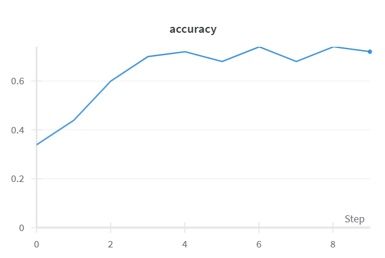
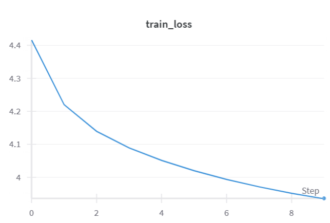
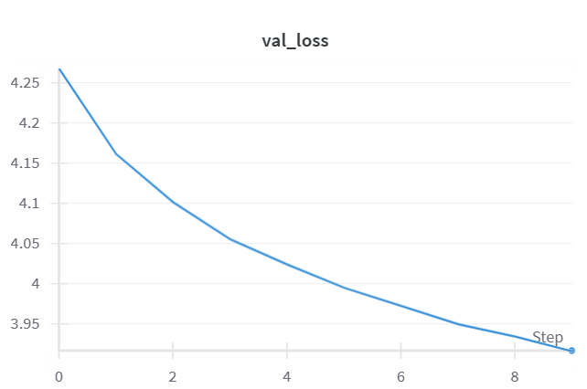
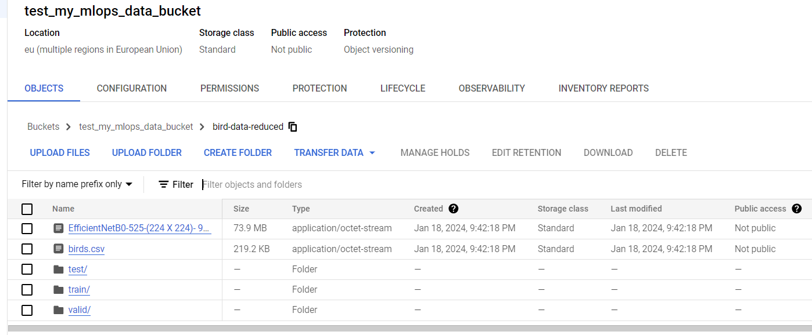
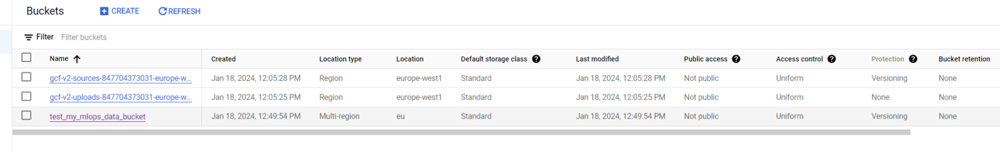
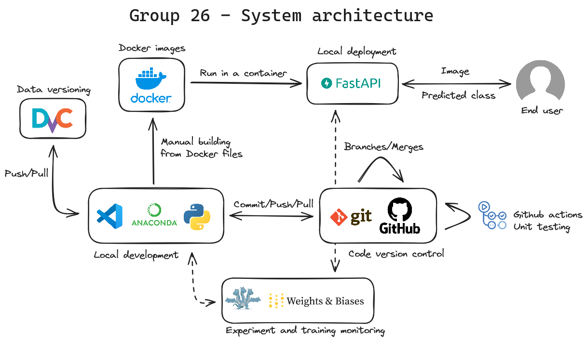

# Exam template for 02476 Machine Learning Operations

This is the report template for the exam. Please only remove the text formatted as with three dashes in front and behind
like:

```--- question 1 fill here ---```

where you instead should add your answers. Any other changes may have unwanted consequences when your report is auto
generated in the end of the course. For questions where you are asked to include images, start by adding the image to
the `figures` subfolder (please only use `.png`, `.jpg` or `.jpeg`) and then add the following code in your answer:

```markdown

```

In addition to this markdown file, we also provide the `report.py` script that provides two utility functions:

Running:

```bash
python report.py html
```

will generate an `.html` page of your report. After deadline for answering this template, we will autoscrape
everything in this `reports` folder and then use this utility to generate an `.html` page that will be your serve
as your final handin.

Running

```bash
python report.py check
```

will check your answers in this template against the constrains listed for each question e.g. is your answer too
short, too long, have you included an image when asked to.

For both functions to work it is important that you do not rename anything. The script have two dependencies that can
be installed with `pip install click markdown`.

## Overall project checklist

The checklist is *exhaustic* which means that it includes everything that you could possible do on the project in
relation the curricilum in this course. Therefore, we do not expect at all that you have checked of all boxes at the
end of the project.

### Week 1

* [ ] Create a git repository
* [ ] Make sure that all team members have write access to the github repository
* [ ] Create a dedicated environment for you project to keep track of your packages
* [ ] Create the initial file structure using cookiecutter
* [ ] Fill out the `make_dataset.py` file such that it downloads whatever data you need and
* [ ] Add a model file and a training script and get that running
* [ ] Remember to fill out the `requirements.txt` file with whatever dependencies that you are using
* [ ] Remember to comply with good coding practices (`pep8`) while doing the project
* [ ] Do a bit of code typing and remember to document essential parts of your code
* [ ] Setup version control for your data or part of your data
* [ ] Construct one or multiple docker files for your code
* [ ] Build the docker files locally and make sure they work as intended
* [ ] Write one or multiple configurations files for your experiments
* [ ] Used Hydra to load the configurations and manage your hyperparameters
* [ ] When you have something that works somewhat, remember at some point to to some profiling and see if
      you can optimize your code
* [ ] Use Weights & Biases to log training progress and other important metrics/artifacts in your code. Additionally,
      consider running a hyperparameter optimization sweep.
* [ ] Use Pytorch-lightning (if applicable) to reduce the amount of boilerplate in your code

### Week 2

* [ ] Write unit tests related to the data part of your code
* [ ] Write unit tests related to model construction and or model training
* [ ] Calculate the coverage.
* [ ] Get some continuous integration running on the github repository
* [ ] Create a data storage in GCP Bucket for you data and preferable link this with your data version control setup
* [ ] Create a trigger workflow for automatically building your docker images
* [ ] Get your model training in GCP using either the Engine or Vertex AI
* [ ] Create a FastAPI application that can do inference using your model
* [ ] If applicable, consider deploying the model locally using torchserve
* [ ] Deploy your model in GCP using either Functions or Run as the backend

### Week 3

* [ ] Check how robust your model is towards data drifting
* [ ] Setup monitoring for the system telemetry of your deployed model
* [ ] Setup monitoring for the performance of your deployed model
* [ ] If applicable, play around with distributed data loading
* [ ] If applicable, play around with distributed model training
* [ ] Play around with quantization, compilation and pruning for you trained models to increase inference speed

### Additional

* [ ] Revisit your initial project description. Did the project turn out as you wanted?
* [ ] Make sure all group members have a understanding about all parts of the project
* [ ] Uploaded all your code to github

## Group information

### Question 1
> **Enter the group number you signed up on <learn.inside.dtu.dk>**
>
> Answer:

Group 26

### Question 2
> **Enter the study number for each member in the group**
>
> Example:
>
> *sXXXXXX, sXXXXXX, sXXXXXX*
>
> Answer:

S231847, S194825, S222730, S23228, S212367

### Question 3
> **What framework did you choose to work with and did it help you complete the project?**
>
> Answer length: 100-200 words.
>
> Example:
> *We used the third-party framework ... in our project. We used functionality ... and functionality ... from the*
> *package to do ... and ... in our project*.
>
> Answer:

We used the framework called Pytorch-image-models, also known as TIMM, to load and use a pretrained image classification model: ResNet 50. This model was the base that we extended with a final fully connected layer in order to be able to classify the correct number of classes.

## Coding environment

> In the following section we are interested in learning more about you local development environment.

### Question 4

> **Explain how you managed dependencies in your project? Explain the process a new team member would have to go**
> **through to get an exact copy of your environment.**
>
> Answer length: 100-200 words
>
> Example:
> *We used ... for managing our dependencies. The list of dependencies was auto-generated using ... . To get a*
> *complete copy of our development environment, one would have to run the following commands*
>
> Answer:

We managed dependencies using the package manager Anaconda. This allowed us to have a dedicated environment for our project. We also used the python package called pipreqs to generate the requirement file. To get an exact copy of the environment, someone would need to install anaconda, download the requirement txt file and run the commands:
conda create --name test
conda activate test
pip install -r requirements.txt

### Question 5

> **We expect that you initialized your project using the cookiecutter template. Explain the overall structure of your**
> **code. Did you fill out every folder or only a subset?**
>
> Answer length: 100-200 words
>
> Example:
> *From the cookiecutter template we have filled out the ... , ... and ... folder. We have removed the ... folder*
> *because we did not use any ... in our project. We have added an ... folder that contains ... for running our*
> *experiments.*
> Answer:

From the cookiecutter template we have filled out the following folders: data, src, test and dockerfiles. We have not removed the other folders but some of them were filled with generated files, for example, model weights and figures. We have added a github\workflows folder that contains the files to run the github actions for testing.

### Question 6

> **Did you implement any rules for code quality and format? Additionally, explain with your own words why these**
> **concepts matters in larger projects.**
>
> Answer length: 50-100 words.
>
> Answer:

We did run ruff manually on some of our files. In larger projects, rules for code quality and format matter because they help keep consistency over the files and they improve readability which makes it easier to read others' code and spot bugs.

## Version control

> In the following section we are interested in how version control was used in your project during development to
> corporate and increase the quality of your code.

### Question 7

> **How many tests did you implement and what are they testing in your code?**
>
> Answer length: 50-100 words.
>
> Example:
> *In total we have implemented X tests. Primarily we are testing ... and ... as these the most critical parts of our*
> *application but also ... .*
>
> Answer:

In total 12 tests were implemented, these tests were run by the framework pytest. The tests are primarily focused on the data and the model. The tests ensure that the raw data has been loaded correctly without any corrupted or missing files and tests if the labels are consistent across datasets, furthermore it tests if the data is processed correctly. For the model the tests ensure the robustness of the model by testing if the model has the correct output shape, if the model is able to work with inputs of different sizes, if the model switches correctly in train and evaluate mode, if the forward pass is consistent, and the gradient flow. 

### Question 8

> **What is the total code coverage (in percentage) of your code? If you code had an code coverage of 100% (or close**
> **to), would you still trust it to be error free? Explain you reasoning.**
>
> Answer length: 100-200 words.
>
> Example:
> *The total code coverage of code is X%, which includes all our source code. We are far from 100% coverage of our **
> *code and even if we were then...*
>
> Answer:

| src\__init__.py | 1 | 0 | 100%

 <table>
  <tr>
    <th>Name</th>
    <th>Stmts</th>
    <th>Miss</th>
    <th>Cover</th>
  </tr>
  <tr>
    <td>src\data\__init__.py</td>
    <td>0</td>
    <td>0</td>
    <td>100%</td>
  </tr>
  <tr>
    <td>src\data\make_dataset.py</td>
    <td>18</td>
    <td>6</td>
    <td>67%</td>
  </tr>
  <tr>
    <td>src\models\__init__.py </td>
    <td>0</td>
    <td>0</td>
    <td>100%</td>
  </tr>
  <tr>
    <td>src\models\model.py</td>
    <td>35</td>
    <td>17</td>
    <td>51%</td>
  </tr>
  <tr>
    <td>tests\__init__.py</td>
    <td>4</td>
    <td>0</td>
    <td>100%</td>
  </tr>
  <tr>
    <td>tests\test_data_processed.py</td>
    <td>15</td>
    <td>1</td>
    <td>93%</td>
  </tr>
  <tr>
    <td>tests\test_data_raw.py</td>
    <td>29</td>
    <td>2</td>
    <td>93%</td>
  </tr>
  <tr>
    <td>tests\test_model.py</td>
    <td>45</td>
    <td>0</td>
    <td>100%</td>
  </tr>
  <tr>
    <td>TOTAL</td>
    <td>147</td>
    <td>26</td>
    <td>82%</td>
  </tr>
</table>                 

As seen above we have 4 files with a coverage of 100%, but it doesn't guarantee that the code is completely error-free. Code coverage simply measures the percentage of lines executed during testing but doesn't necessarily account for all possible inputs.

### Question 9

> **Did you workflow include using branches and pull requests? If yes, explain how. If not, explain how branches and**
> **pull request can help improve version control.**
>
> Answer length: 100-200 words.
>
> Example:
> *We made use of both branches and PRs in our project. In our group, each member had an branch that they worked on in*
> *addition to the main branch. To merge code we ...*
>
> Answer:

We used branches to work on features and make sure they are functional before merging into main. We did not use pull requests. Pull requests improve version control by giving a better overview of the changes and their reasons (with comments).

### Question 10

> **Did you use DVC for managing data in your project? If yes, then how did it improve your project to have version**
> **control of your data. If no, explain a case where it would be beneficial to have version control of your data.**
>
> Answer length: 100-200 words.
>
> Example:
> *We did make use of DVC in the following way: ... . In the end it helped us in ... for controlling ... part of our*
> *pipeline*
>
> Answer:

We initially did not use DVC for our project but decided to use it anyway towards the end. We took a very large dataset and used only a part of it. Using DVC on our cloud Bucket, we can ensure that everyone works on the exact same partition of the dataset at all times.

### Question 11

> **Discuss you continues integration setup. What kind of CI are you running (unittesting, linting, etc.)? Do you test**
> **multiple operating systems, python version etc. Do you make use of caching? Feel free to insert a link to one of**
> **your github actions workflow.**
>
> Answer length: 200-300 words.
>
> Example:
> *We have organized our CI into 3 separate files: one for doing ..., one for running ... testing and one for running*
> *... . In particular for our ..., we used ... .An example of a triggered workflow can be seen here: <weblink>*
>
> Answer:

We used the pytests mentioned before in question 8 for unit testing different aspects of the model for continuous integration. All the tests are in one workflow, which is in hindsight not the most convenient way to implement it. It would be more convenient to split the workflow for different aspects. The unit tests, like mentioned before, verify the robustness of the model and check that the raw and processed data are handled correctly. The CI setup only runs test for the latest ubuntu operation system, since all of the group member are working with a windows device, but it would be more sensible to test on other operation systems like mac os. Furthermore all the members agreed on working in the environment with python version 11, so the tests in CI are written to work for python 11. 

## Running code and tracking experiments

> In the following section we are interested in learning more about the experimental setup for running your code and
> especially the reproducibility of your experiments.

### Question 12

> **How did you configure experiments? Did you make use of config files? Explain with coding examples of how you would**
> **run a experiment.**
>
> Answer length: 50-100 words.
>
> Example:
> *We used a simple argparser, that worked in the following way: python my_script.py --lr 1e-3 --batch_size 25*
>
> Answer:

We used hydra which is a python package for tracking experiments and hyperparameters in log files. An experiment on the training of our model can follow these steps: 
Fill in the config.yaml file with the hyperparameters you want.
Run the training script.
Once the training is done, you can look at the files generated by hydra.

### Question 13

> **Reproducibility of experiments are important. Related to the last question, how did you secure that no information**
> **is lost when running experiments and that your experiments are reproducible?**
>
> Answer length: 100-200 words.
>
> Example:
> *We made use of config files. Whenever an experiment is run the following happens: ... . To reproduce an experiment*
> *one would have to do ...*
>
> Answer:

We make sure that no information is lost when running the experiments by using config files which generates logs with both the parameters used and the date and the time of the experiment. And as for the code, we used simple code versioning with git.

### Question 14

> **Upload 1 to 3 screenshots that show the experiments that you have done in W&B (or another experiment tracking**
> **service of your choice). This may include loss graphs, logged images, hyperparameter sweeps etc. You can take**
> **inspiration from [this figure](figures/wandb.png). Explain what metrics you are tracking and why they are**
> **important.**
>
> Answer length: 200-300 words + 1 to 3 screenshots.
>
> Example:
> *As seen in the first image when have tracked ... and ... which both inform us about ... in our experiments.*
> *As seen in the second image we are also tracking ... and ...*
>
> Answer:

Please find below screenshots of training curves generated by weights & bias, we tracked the accuracy of our classifier, as well as the training and validation loss. These metrics are important to track because they reflect the state of training, so they can be used to choose the best model and to characterize the model.




### Question 15

> **Docker is an important tool for creating containerized applications. Explain how you used docker in your**
> **experiments? Include how you would run your docker images and include a link to one of your docker files.**
>
> Answer length: 100-200 words.
>
> Example:
> *For our project we developed several images: one for training, inference and deployment. For example to run the*
> *training docker image: `docker run trainer:latest lr=1e-3 batch_size=64`. Link to docker file: <weblink>*
>
> Answer:

For our projects we developed two docker images, one for our FastAPI application and one for training our model.
For our fast API app, we built a docker image using api.dockerfile. Once the image was created, the image was run using: 
docker run --name mycontainer -p 80:80 my_fast_app
Which could then be accessed using localhost/docs. Link to dockerfile:
<https://github.com/npfvr1/mlops-project-26/blob/main/mlops-project-26/dockerfiles/api.dockerfile>

### Question 16

> **When running into bugs while trying to run your experiments, how did you perform debugging? Additionally, did you**
> **try to profile your code or do you think it is already perfect?**
>
> Answer length: 100-200 words.
>
> Example:
> *Debugging method was dependent on group member. Some just used ... and others used ... . We did a single profiling*
> *run of our main code at some point that showed ...*
>
> Answer:

The debugging method was dependent on group members. Some just used the VS Code debugging feature and others used manual debugging when running into errors. We did not profile our code but we would definitely benefit from doing it.

## Working in the cloud

> In the following section we would like to know more about your experience when developing in the cloud.

### Question 17

> **List all the GCP services that you made use of in your project and shortly explain what each service does?**
>
> Answer length: 50-200 words.
>
> Example:
> *We used the following two services: Engine and Bucket. Engine is used for... and Bucket is used for...*
>
> Answer:

We used the Google Cloud Bucket service in our project. Bucket allows users to store data in 'buckets', which are containers to store your data in. You pay a certain amount per GB and it scales pretty easily. We also tried to run Google Cloud Engine to train our model, but we were not able to implement this on time. Engine allows users to select hardware in the cloud to train your model.

### Question 18

> **The backbone of GCP is the Compute engine. Explained how you made use of this service and what type of VMs**
> **you used?**
>
> Answer length: 100-200 words.
>
> Example:
> *We used the compute engine to run our ... . We used instances with the following hardware: ... and we started the*
> *using a custom container: ...*
>
> Answer:

We were not able to make GCP compute engine run on time. Initially, we used an instance with E2-Medium hardware, mainly because we were afraid we would run out of credits. The idea was to use this to get the training weights of our model which would then be used in our FastAPI application to run inference.

### Question 19

> **Insert 1-2 images of your GCP bucket, such that we can see what data you have stored in it.**
> **You can take inspiration from [this figure](figures/bucket.png).**
>
> Answer:




### Question 20

> **Upload one image of your GCP container registry, such that we can see the different images that you have stored.**
> **You can take inspiration from [this figure](figures/registry.png).**
>
> Answer:

Due to time limitations, we did not attempt to add one of our Docker images to the GCP container registry.

### Question 21

> **Upload one image of your GCP cloud build history, so we can see the history of the images that have been build in**
> **your project. You can take inspiration from [this figure](figures/build.png).**
>
> Answer:

Due to time limitations, we were not able to build anything on GCP cloud.

### Question 22

> **Did you manage to deploy your model, either in locally or cloud? If not, describe why. If yes, describe how and**
> **preferably how you invoke your deployed service?**
>
> Answer length: 100-200 words.
>
> Example:
> *For deployment we wrapped our model into application using ... . We first tried locally serving the model, which*
> *worked. Afterwards we deployed it in the cloud, using ... . To invoke the service an user would call*
> *`curl -X POST -F "file=@file.json"<weburl>`*
>
> Answer:

We deployed our model locally and wrapped it into a fastapi application within a docker container. We don't deploy the model in the google cloud because we cannot make GCP compute engine run on time.

### Question 23

> **Did you manage to implement monitoring of your deployed model? If yes, explain how it works. If not, explain how**
> **monitoring would help the longevity of your application.**
>
> Answer length: 100-200 words.
>
> Example:
> *We did not manage to implement monitoring. We would like to have monitoring implemented such that over time we could*
> *measure ... and ... that would inform us about this ... behaviour of our application.*
>
> Answer:

We did not manage to implement the monitoring of our deployed model. Monitoring helps the longevity of the application by providing us with data to see whether the model is performing correctly over time, how it is working, and notifying of any error that could occur. In our case of classifying bird images into species, monitoring could help us determine the accuracy of our model over time for example.

### Question 24

> **How many credits did you end up using during the project and what service was most expensive?**
>
> Answer length: 25-100 words.
>
> Example:
> *Group member 1 used ..., Group member 2 used ..., in total ... credits was spend during development. The service*
> *costing the most was ... due to ...*
>
> Answer:

We ended up using around 7.65$ in credits during this project, and in our project this is mostly due to GCP Bucket in which we stored our dataset. If we got GCP Engine to run, that could have surpassed GCP Bucket, as we would need to upgrade our instance from E2-Medium to better hardware towards the end of the project to increase training speed.

## Overall discussion of project

> In the following section we would like you to think about the general structure of your project.

### Question 25

> **Include a figure that describes the overall architecture of your system and what services that you make use of.**
> **You can take inspiration from [this figure](figures/overview.png). Additionally in your own words, explain the**
> **overall steps in figure.**
>
> Answer length: 200-400 words
>
> Example:
>
> *The starting point of the diagram is our local setup, where we integrated ... and ... and ... into our code.*
> *Whenever we commit code and puch to github, it auto triggers ... and ... . From there the diagram shows ...*
>
> Answer:

Please find below a drawing of the architecture of our system. We used the components as we learned during the course.


### Question 26

> **Discuss the overall struggles of the project. Where did you spend most time and what did you do to overcome these**
> **challenges?**
>
> Answer length: 200-400 words.
>
> Example:
> *The biggest challenges in the project was using ... tool to do ... . The reason for this was ...*
>
> Answer:

We faced many challenges in this project, mainly because we are a hybrid group, where some people worked in person while others worked from home. One of our main issues was with the dataset, as we partitioned this multiple times due to various reasons. Before we implemented DVC, we sometimes ended up with people using different versions of the dataset. Another issue we faced was implementing the model. Although, the focus of the course was never on the model, we still struggled with deploying it and getting it to run inference. Lastly, a major challenge was getting GCP Engine to work. We did believe this was mostly due to inexperience, and if we had a bit more time, we probably would have done the Engine implementation.

### Question 27

> **State the individual contributions of each team member. This is required information from DTU, because we need to**
> **make sure all members contributed actively to the project**
>
> Answer length: 50-200 words.
>
> Example:
> *Student sXXXXXX was in charge of developing of setting up the initial cookie cutter project and developing of the*
> *docker containers for training our applications.*
> *Student sXXXXXX was in charge of training our models in the cloud and deploying them afterwards.*
> *All members contributed to code by...*
>
> Answer:

Student S194825 worked with the preprocessing of data for the model to train on as well as developing a docker containers for our fastAPI app. Student s222730 implemented the use of Hydra for config files and the use of Weights and Biases to monitor the training of the model, and worked on splitting the model notebook into three python scripts (model definition, training, and prediction). Student S212367 and S232281 were responsible for the DVC, the things attempted in GCP and helped with the fastAPI. Student S231847 took on the responsibility of handling data preprocessing, implementing unit tests throughout the project, and setting up CI workflows on GitHub. Additionally, tried local deployment, completing half of the task with the handler.py file.
